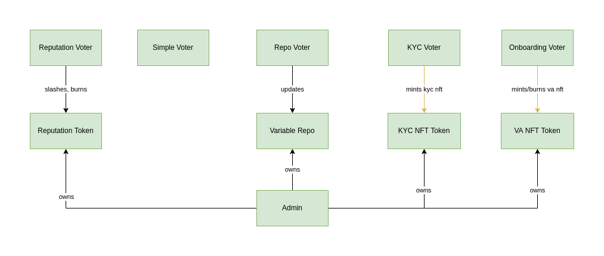
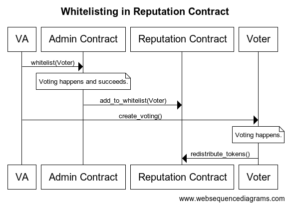
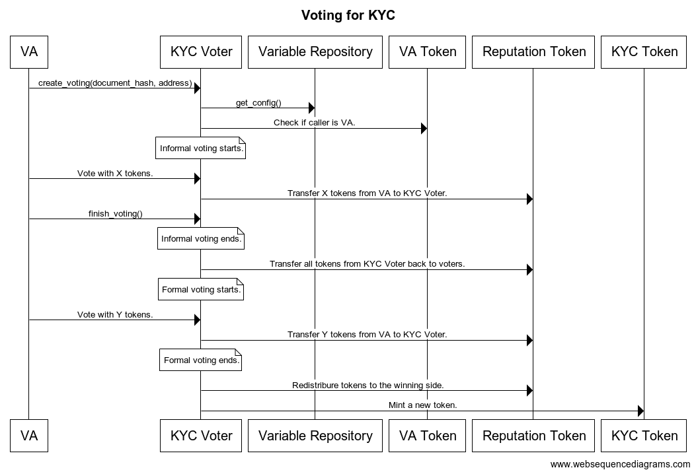

# DAO - High Level Architecture

The following document should allow the understanding high-level architecture of the DAO contracts.

The project is still under the development and the architecture can change.

## Core Contracts
There are 5 **core contracts**, that store all the necessary data:
- Admin Contract
- Reputation Token Contract
- Variable Repository Contract
- KYC Token
- VA Token

Besides Admin Contract, all core contracts have an admin account specified. Admin has special rights and can:
- change admin to another address,
- control whitelist of addresses with special privileges.

All data in every contract is available to be read by everyone.

### Admin Contract
Admin Contract's main goal is to serve as the owner of all other core contracts.
Any VA can initialize a vote that might result in actions in contracts administered by Admin Contract. 
These actions are:
- changing ownership,
- add a new address to the whitelist,
- remove existing address from the whitelist.

All changes require voting. Admin Contract is both a core contract and voter contract.

### Reputation Token Contract
The contract keeps track of reputation tokens for every user.
It is a fungible token.
Whitelisted addresses can:
- mints new tokens,
- burns existing tokens,
- transfer users' tokens.

Only addresses with a positive amount of tokens can participate in the voting process.

#### Debt mechanism
There is a special case, that needs to be handled.
The following scenario is possible:
1. VA has X tokens. 
She uses all to vote in the voting V. 
2. Contract that realizes voting V receives VA's tokens. VA has zero now.
3. In the meantime Reputation Voter results in the decision to burn Y tokens from VA. Unfortunately, VA has zero tokens in her balance. So nothing happens.
4. Voting V ends and X tokens get back to VA. VA has X, while she should have X minus Y of tokens.

To combat this issue we introduce the concept of debt. It results in the following behavior:
- when burning more tokens than an account has, the surplus is recorded as debt,
- when minting new tokens, firstly debt has to be reduced before the balance can be incremented.
- when transferring tokens into the account, firstly debt needs to be covered, and the remainder is added to the balance.
- when debt is more than zero, the balance of tokens is treated as zero. 

Having that solves the problem from point 4.

### Variable Repository Contract
It manages variables used in the whole system.
Whitelisted addresses can update a value of any variable in two modes:
- immediately,
- with the delay at the specific timestamp.

### KYC Token Contract
It keeps track of addresses that passed the KYC process. 
It is a nonfungible token.
Whitelisted addresses can burn and mint new tokens.
Each address can have zero or one token. 

### VA Token Contract
It keeps track of addresses that are VAs in the system. 
Only addresses with VA tokens can participate in the voting process.
Whitelisted addresses can burn and mint new tokens.
Each address can have zero or one token. 

## Voter Contracts
There is also 5 **voter contracts** or **voters** that can alter core contracts' data:
- Reputation Voter
- Simple Voter
- Repo Voter
- KYC Voter
- Onboarding Voter

Each voter needs to be whitelisted in the specific core contract, to be able to alter data.
Each voter needs to be whitelisted in the Reputation Contract, to be able to use tokens for voting.
Only VAs can participate in voting.

### Whitelisting
The following diagram shows the whitelisting process of a new voter contract.

### Voting
The below diagram shows how voting works.

### Reputation Voter
Reputation Voter allows VAs to mint and burn tokens to/from a given address in Reputation Contract.
Reputation Voter needs to be whitelisted in Reputation Contract.

### Simple Voter
Simple Voter allows VAs to vote under a hash of a document. The document can represent anything. After the vote ends no special action is performed.
Simple Voter needs to be whitelisted in the Reputation Contract.

### Repo Voter
Repo Voter (shorter name of Variable Repository Voter) allows VAs to vote under a change of a variable in Variable Repository Contract.
Repo Voter needs to be whitelisted in Reputation Contract and Variable Repository Contract.

### KYC Voter
KYC Voter allows VAs to mint new tokens in KYC Token Contract. The subject of voting is a document hash. 
KYC Voter needs to be whitelisted in the Reputation Contract and KYC Token Contract.

### Onboarding Voter
Onboarding Voter allows VAs to mint and burn tokens in VA Token Contract. Only addresses that have a positive reputation balance and KYC token can be a subject of this voting.
Onboarding Voter needs to be whitelisted in Reputation Contract and VA Token Contract.
